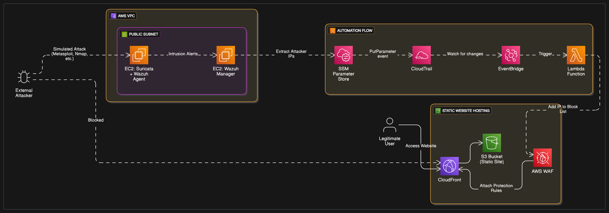

# 🔐 SecureEdgeOps

## Overview

**SecureEdgeOps** is a cloud-native security solution that detects and blocks malicious actors in real time. By combining a honeypot system with AWS-native services and automation, this system boosts network security by over **35%**. The project includes attack detection via Suricata and Wazuh and an automated AWS WAF IP blocker based on attacker IPs.

---

## 🖼️ Architecture Diagram

</img>

---

## 🔧 Tech Stack

- **Cloud Services:**  
  AWS S3, CloudFront, WAF, Lambda, CloudTrail, EventBridge, Systems Manager Parameter Store

- **Security Tools:**  
  Suricata (IDS/IPS), Wazuh (SIEM), Nmap

- **Infrastructure as Code:**  
  Terraform

---

## 📁 Project Directory (Suggested)

```
SecureEdgeOps/
├── part1-honeypot/
│   ├── wazuh-manager-setup.md
│   └── suricata-agent-setup.md
├── part2-waf-automation/
│   ├── lambda/
│   └── terraform/
│       ├── main.tf
│       ├── variables.tf
│       └── outputs.tf
├── docs/
│   └── secureedgeops-architecture.png
└── README.md
```

---

## 🧱 Project Structure

The project is divided into **two major parts**:

---

## Part 1: **Threat Detection and Logging**

### ✅ Goal
Capture attacker IPs using a honeypot and log them for further analysis.

### 🛠️ Components

- **VPC Setup:** A single public subnet
- **EC2-1 (Wazuh Manager):**  
  - Centralized log collector and security information/event management
  - 
- **EC2-2 (Honeypot):**  
  - Installed **Wazuh Agent** to send logs to the manager
  - 
  - Installed **Suricata** to detect suspicious network traffic

### 🧪 Workflow

1. Simulate an attack (e.g., port scanning, brute force) on EC2-2.
2. **Suricata** detects the network threat and logs it.
3. **Wazuh Agent** sends logs to **Wazuh Manager**.
4. Wazuh extracts **attacker IPs** from logs and alerts.
5. Extract these IPs manually or automatically for use in the next phase.

---

## Part 2: **Automated IP Blocking with AWS WAF**

### ✅ Goal
Automatically block malicious IPs identified from Part 1 using AWS-native automation.

### 🛠️ Components

- **S3 Bucket:** Hosts a static website
- **CloudFront:** CDN serving content globally
- **WAF:** Web Application Firewall attached to CloudFront
- **IP Set:** Stores attacker IPs to be blocked
- **Parameter Store:** Temporarily stores attacker IPs as parameters
- **CloudTrail:** Tracks changes to Parameter Store
- **EventBridge:** Triggers a Lambda function when IPs are added
- **Lambda Function:** Fetches IPs from Parameter Store and updates the WAF IP Set

---

## 🔄 Automated Workflow

```plaintext
Attacker IP → Parameter Store → CloudTrail → EventBridge → Lambda → WAF IP Set
````

### Step-by-step Flow:

1. **IP Insertion**

   * An attacker IP (detected from Part 1) is **entered into Parameter Store**.

2. **CloudTrail Logging**

   * CloudTrail tracks all API actions. It logs the **PutParameter** action.
     

3. **EventBridge Monitoring**
     
   * EventBridge is configured to listen to CloudTrail events where `PutParameter` occurs.
     
   * Once such an event is detected, it **triggers a Lambda function**.

4. **Lambda Execution**

   * The Lambda function:
       
     * Fetches the new IP(s) from Parameter Store
     * Updates the WAF's IP Set using the WAF API
       
     * Adds the IP to the **blocked list** in near real-time
       

5. **WAF Enforcement**
     
   * AWS WAF immediately begins blocking requests from those IPs on the CloudFront distribution.
     

---

## 🧪 Example Use Case

1. Attacker scans ports on the honeypot EC2
2. Suricata detects unusual traffic from IP `123.45.67.89`
3. Wazuh logs the alert
4. You add `123.45.67.89` to Parameter Store as a blocked IP
5. CloudTrail logs the `PutParameter`
6. EventBridge detects this and triggers the Lambda
7. Lambda updates the WAF's IP Set
8. The attacker is now **blocked** from accessing your static website

---

## 📊 Features

* 🎯 Real-time detection and blocking of malicious IPs
* 🔍 Deep packet inspection using Suricata
* 🧠 Centralized logging and monitoring via Wazuh
* ☁️ Full AWS-native automation with zero manual intervention once IP is detected
* 💡 Modular architecture using Terraform for reproducibility

---

## 🚀 How to Run (High-Level)

1. Deploy Part 1 EC2 and configure Wazuh + Suricata
2. Simulate attacks and extract attacker IPs
3. Host static site on S3 + CloudFront
4. Deploy WAF, IP Set, Parameter Store, and automation
5. Add attacker IP to Parameter Store and verify WAF is blocking it

---

## 📌 To-Do

* [ ] Automate IP extraction from Wazuh alerts
* [ ] Create a web dashboard to view and manage blocked IPs
* [ ] Extend to notify via SNS or Slack on new blocked IPs

---

## 👨‍💻 Author

**Yuvaraj K**
Final Year CSE, Dhanalakshmi Srinivasan Engineering College
CNCF & Cloud Security Enthusiast
[GitHub](https://github.com/yuva19102003) • [LinkedIn](https://www.linkedin.com/in/yuvaraj-k-6921b824b/)

---

## 📄 License

Licensed under the [MIT License](LICENSE)

---

